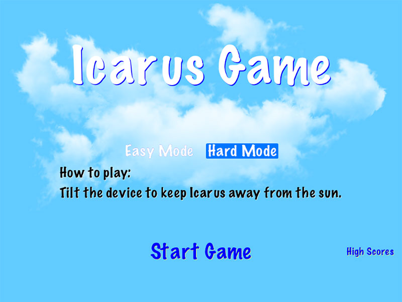
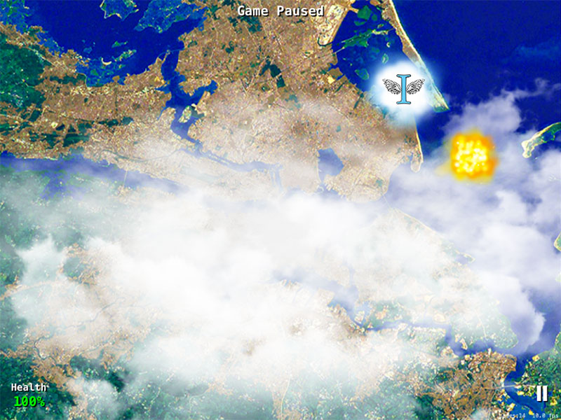
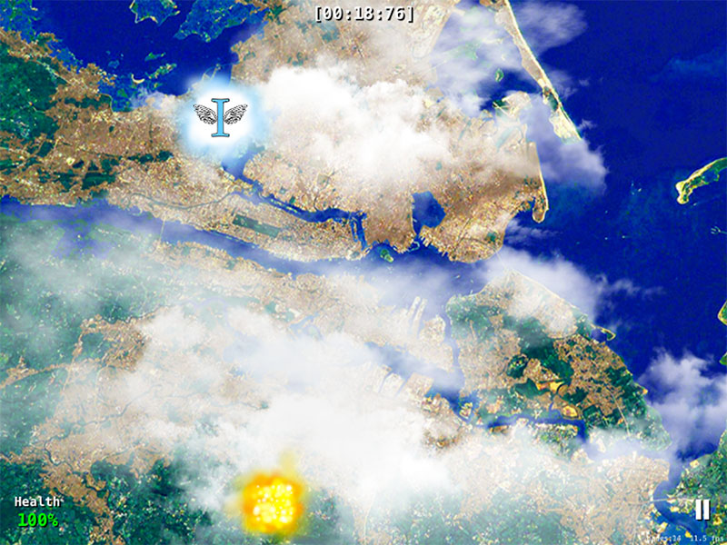
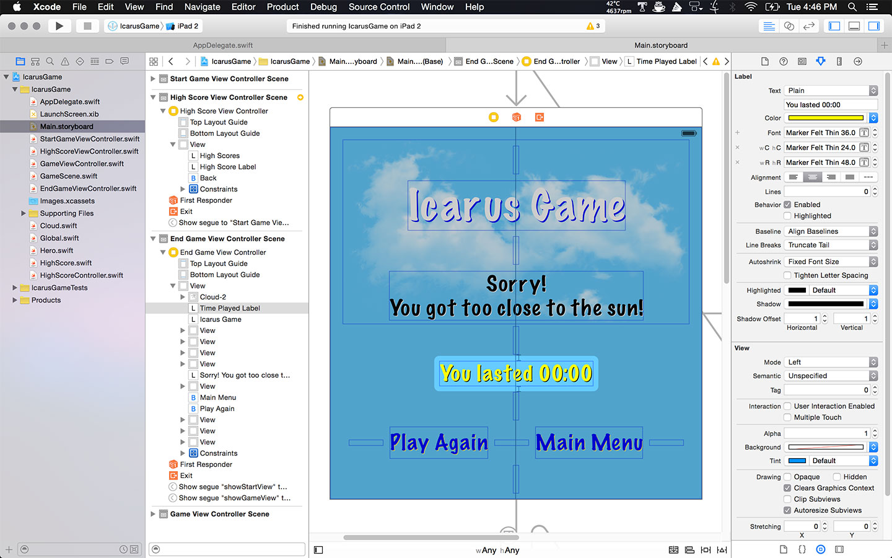

# MyTopProjectRightNow

## An iOS Universal Game using Swift 2

## About 
MyTopProjectRightNow is my work in progress for Icarus Game (tentatively titled), a game using Swift 2, SpriteKit, and the Accelerometer. Everything is written from scratch and no frameworks have been used besides UIKit, SpriteKit and Foundation. I'm currently simulating parallax effects, randomly-generated clouds, etc. I came up with all logic, calculation and math functions on my own. I am unaware if they exist somewhere already (likely so) but I wanted to do this as a personal challenge.

Many extra features and updated graphics to come. This game uses the accelerometer for movement, and will be using multi-touch simultaneously for added difficulty. The game is compatible with all iOS devices running iOS 9.0 or later and scales appropriately to each device (iPod touch, iPhone, iPad, etc).

### To implement:
* powerups w/ explosion on ground effects
* generation of extra obstacles
* multi-touch for extra obstacles

### To fix:
* load correct view from save state
* save state not working on device always - why? works in Simulator ok and works on
  device when ran through Xcode
* set up correct auto-pause on save state, let user unpause on reload

### Gameplay footage is available on youtube https://youtu.be/-59yhDjqniU

